[6班_ポートフォリオ_カッパ杯サマー.md](https://github.com/user-attachments/files/28377092/6._._.md)
# Kappa-Cup-Summer# ギョギョぴっち

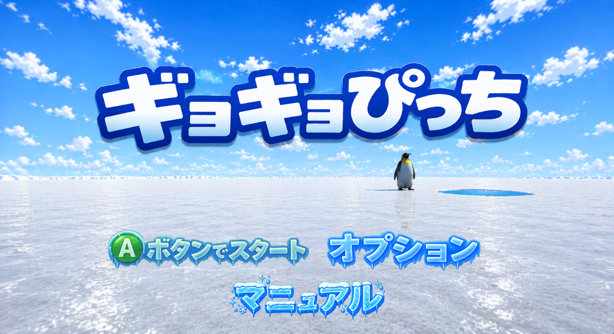

 **河原電子ビジネス専門学校 ゲームクリエイター科 2年（28卒）**   

 **氏名**

 **三宗 樹利亜（みつむね　じゅりあ）**  
 プレイヤー、エネミーを担当
 
 **殿河内 春人（とのこうち　はると）**  
 エフェクト、ステージを担当

 **松本 朋己（まつもと　ともき）**  
 UI、ゲームシーンを担当

 GitHubのURL  
 https://github.com/MatumotoTomoki/fish_skates<br>
 YoutubeのURL<br>https://youtu.be/UyNrojLjWoo

 # 目次 <a id="toc"></a>
 [ギョギョぴっち](#ギョギョぴっち)  
 [目次](#目次)  
 [作品概要](#作品概要)  
 [ゲーム説明](#ゲーム説明)  
 [ゲーム詳細](#ゲーム詳細)  
 [プレイヤーについて](#プレイヤーについて)  
 [UIについて](#uiについて)  
 [技術紹介](#技術紹介)

# 作品概要

 **タイトル**  
 　ギョギョぴょち

 **作成人数**  
 　3人

 **作成期間**  
 2026年2月～

 **ゲームジャンル**  
  3Dアクションゲーム

 **プレイ人数**  
  1人

  **使用言語**  
   C++  
   HLSL

 **使用ツール**  
 - Visual Studio 2022  
 - Adobe Photoshop 2026  
 - 3ds Max 2026  
 - Effekseer
 - GitHub
 - Fork
 - texconv.exe

 **開発環境**  
 - K2Engine（学校内製エンジン）  
 - Windows11

 # 担当ソースコード

 ### 三宗 樹利亜  
 <details>
<summary>ゲーム部分</summary>  
 ・Player.cpp  

 ・Player.h  
 ・Dummy.cpp  
 ・Dummy.h    
 ・Dummy3.cpp  
 ・Dummy3.h  
 ・Dummy5.cpp  
 ・Dummy5.h  
 ・Pengin.cpp  
 ・Pengin.h  
 ・SilenPengin.cpp  
 ・SilenPengin.h  
 ・NinjaPengin.cpp  
 ・NinjaPengin.h  
 ・Game.cpp  
 ・Game.h
 </details>  

 ### 松本 朋己
 <details>
<summary>ゲーム部分</summary> 
 ・Pause.cpp

 ・Pause.h  
 ・Title.cpp  
 ・Title.h  
 ・UI.cpp  
 ・UI.h  
 ・GameClear.cpp  
 ・GameClear.h  
 ・GameOver.cpp  
 ・GameOver.h  
 ・Arrow.cpp  
 ・Arrow.h  
 ・Game.cpp  
 ・Game.h  
</details>   

### 殿河内 春人
<details>
<summary>ゲーム部分</summary> 
・Game.cpp  

・Game.h  
・GameCamera.cpp  
・GameCamera.h  
・Water.cpp  
・Water.h<br>
・RenderToGBufferFor3DModel.fx
</details>

# 操作説明
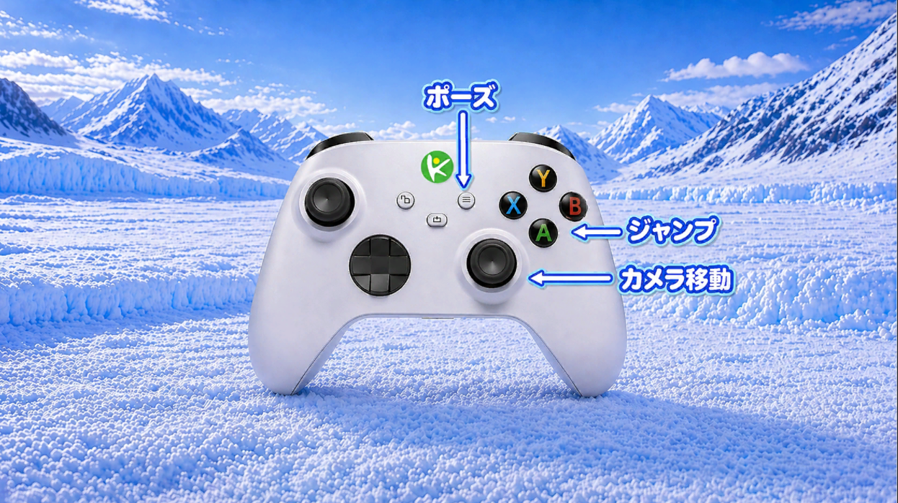

 # ゲーム説明  
 ### ゲーム詳細
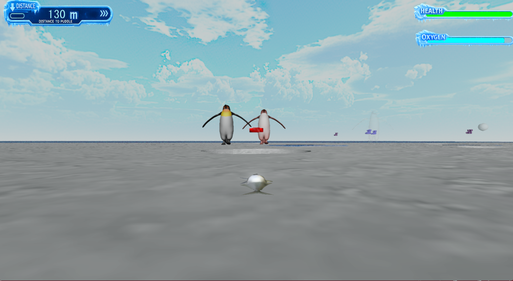
 このゲームは、魚が跳ねて海を目指すアクションゲームです。  
 体力か酸素が尽きる前に海に行くことが目的です。

 ### プレイヤーについて(三宗)

  **魚の挙動**

  - ジャンプ

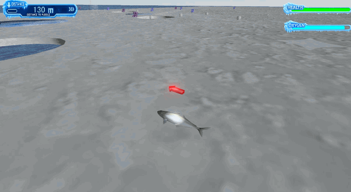

  Aボタンを押すとカメラを向いてる方向に一定距離跳ねます。  
  地面についてない間は移動し続けます。<br>
  こうすることによって、後戻りができないため緊張感が生まれます。

  - スーパージャンプ

  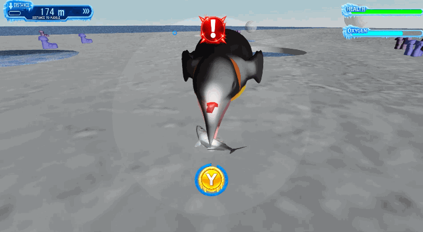

  敵と遭遇した時に十字キーの押した方向に特殊なジャンプができます。  
  これにより多彩なアクションが可能です。<br>
  普通のジャンプでは敵を回避することが困難であったため実装しました。

  ### UIについて(松本)

  **体力と酸素**

  **酸素**

  水中にいる時以外には酸素ゲージが減り続けます。  
  一定数値を下回ると色が変わります。  
  酸素は水場で回復できます。  
  色の順番は水色→黄色→赤色→赤点滅の順番になっています。
  ゲージの残量が視覚的にわかるように変えています。<br>
  点滅させることで、焦りが生まれます。

  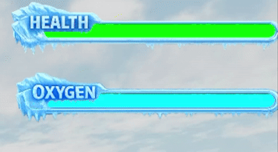

  **回復**

  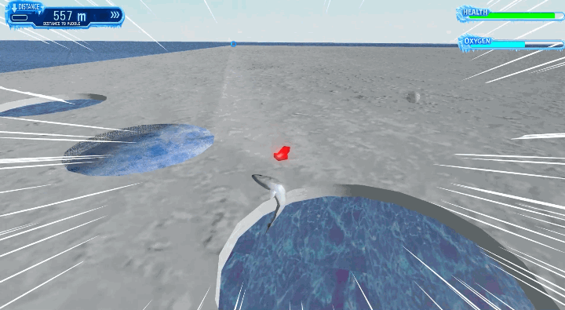

  **体力**

  敵の一定範囲に入ると減り続けます。  
  これも酸素同様に一定数値を下回ると色が変わります。  
  色の順番は緑色→黄色→赤色→赤点滅の順番になっています。
  ゲージの残量が視覚的にわかるように変えています。<br>点滅させることで、焦りが生まれます。

  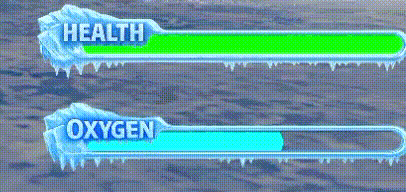

  **最寄りの水場までの距離**

  最寄りの水場までの距離を表示しています。  
  水場の上に透明なオブジェクトを配置して最寄りの水場までの距離を算出しています。  
  透明のオブジェクトを通り過ぎると透明のオブジェクトが次の穴に移動して距離が更新されます。<br>
  これにより、次の穴への距離がわかるので、進むペースを考えられます。<br>
  透明なオブジェクトとプレイヤーの距離を算出し、10で割ったものを表示しています。<br>
  ```
  Vector3 center = m_pos;
Vector3 diff = center - m_player->m_position;
diff /= 10.0f;
float distance = diff.Length();
if (distance >= 999.0f) {
	distance = 999.0f;
}
wchar_t distanceText[64];
swprintf(distanceText, 64, L"%.0f", distance);
m_font.SetText(distanceText);
```

  **矢印**

  最寄りの水場までの方向を示しています。  
  最寄りの水場までの距離と同時に透明のオブジェクトを位置を算出してその方向を示しています。<br>
  透明のオブジェクトを通り過ぎると透明のオブジェクトが次の穴に移動して方向が更新されます。<br>
  これにより、どこに進めばよいかが視覚的にわかりやすくなります。<br>
  透明のオブジェクトの角度を計算することで実装しています。<br>
  ```
  Vector3 toArrow = m_position - m_distance->m_pos;
toArrow.Normalize();
float toAlloedir = atan2f(toArrow.x, toArrow.z);
m_rot.SetRotationY(toAlloedir);
m_modelRender.SetRotation(m_rot);
m_modelRender.Update();
```
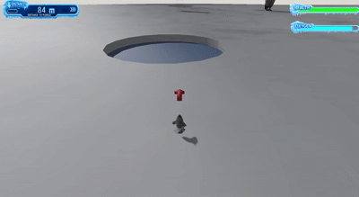

  **十字キー**

  敵と遭遇すると十字キーが表示されます。  
  上下左右対応した方向を押すと光ります。<br>
  光らせることにより、どこを押したのかがわかりやすくなります。  
  同時押しは不可能です。<br>
  十字キーの認識を二段階行うことによって、同時押しをできなくしています。
  ```
if (g_pad[0]->IsTrigger(enButtonLeft) and m_characterController.IsOnGround() == true) {
	if (m_diff.Length() <= 600.0f or m_diff2.Length() <= 600.0f or m_diff3.Length() <= 600.0f or m_diff4.Length() <= 600.0f) {
		SoundSource* se = NewGO<SoundSource>(0);
		se->Init(4);
		se->Play(false);
		float finalSE = (pause->m_sevolume / 10.0f) * (pause->m_master / 10.0f);
		se->SetVolume(finalSE);
		m_jump = 1;
	}
}
if (g_pad[0]->IsTrigger(enButtonRight) and m_characterController.IsOnGround() == true) {
	if (m_diff.Length() <= 600.0f or m_diff2.Length() <= 600.0f or m_diff3.Length() <= 600.0f or m_diff4.Length() <= 600.0f) {
		SoundSource* se = NewGO<SoundSource>(0);
		se->Init(4);
		se->Play(false);
		float finalSE = (pause->m_sevolume / 10.0f) * (pause->m_master / 10.0f);
		se->SetVolume(finalSE);
		m_jump = 2;
	}
}
if (g_pad[0]->IsTrigger(enButtonUp) and m_characterController.IsOnGround() == true) {
	if (m_diff.Length() <= 600.0f or m_diff2.Length() <= 600.0f or m_diff3.Length() <= 600.0f or m_diff4.Length() <= 600.0f) {
		SoundSource* se = NewGO<SoundSource>(0);
		se->Init(4);
		se->Play(false);
		float finalSE = (pause->m_sevolume / 10.0f) * (pause->m_master / 10.0f);
		se->SetVolume(finalSE);
		m_jump = 0;
	}
}
if (g_pad[0]->IsTrigger(enButtonDown) and m_characterController.IsOnGround() == true) {
	if (m_diff.Length() <= 600.0f or m_diff2.Length() <= 600.0f or m_diff3.Length() <= 600.0f or m_diff4.Length() <= 600.0f) {
		SoundSource* se = NewGO<SoundSource>(0);
		se->Init(4);
		se->Play(false);
		float finalSE = (pause->m_sevolume / 10.0f) * (pause->m_master / 10.0f);
		se->SetVolume(finalSE);
		m_jump = 3;
	}
}
switch (m_jump) {
case 0:
	if (g_pad[0]->IsTrigger(enButtonUp) and m_characterController.IsOnGround() == true) {
		if (m_diff.Length() <= 600.0f or m_diff2.Length() <= 600.0f or m_diff3.Length() <= 600.0f or m_diff4.Length() <= 600.0f) {
			m_superJump = true;
			m_velocity.y += 25.0f;
			m_sprite.Init("Assets/sprite/931911.dds", 150.0f, 200.0f);
			m_sprite.SetPosition({ 0.0f,-275.0f,0.0f });
			m_eff2 = NewGO<EffectEmitter>(0);
			m_eff2->Init(2);
			m_eff2->SetScale({ 10.0f,1.0f,10.0f });
			m_eff2->SetPosition(m_position);
			m_eff2->Play();
			SoundSource* se = NewGO<SoundSource>(0);
			se->Init(15);
			se->Play(false);
			float finalSE = (pause->m_sevolume / 10.0f) * (pause->m_master / 10.0f);
			se->SetVolume(finalSE);
			m_sprite.Update();
		}
	}
	break;
case 1:
	if (g_pad[0]->IsTrigger(enButtonLeft) and m_characterController.IsOnGround() == true) {
		if (m_diff.Length() <= 600.0f or m_diff2.Length() <= 600.0f or m_diff3.Length() <= 600.0f or m_diff4.Length() <= 600.0f) {
			m_superJump = true;
			m_velocity.x -= 300.0f;
			m_velocity.y += 25.0f;
			m_sprite.Init("Assets/sprite/931908.dds", 200.0f, 150.0f);
			m_sprite.SetPosition({ -25.0f,-300.0f,0.0f });
			m_eff2 = NewGO<EffectEmitter>(0);
			m_eff2->Init(2);
			m_eff2->SetScale({ 10.0f,1.0f,10.0f });
			m_eff2->SetPosition(m_position);
			m_eff2->Play();
			SoundSource* se = NewGO<SoundSource>(0);
			se->Init(15);
			se->Play(false);
			float finalSE = (pause->m_sevolume / 10.0f) * (pause->m_master / 10.0f);
			se->SetVolume(finalSE);
			m_sprite.Update();
		}
	}
	break;
case 2:
	if (g_pad[0]->IsTrigger(enButtonRight) and m_characterController.IsOnGround() == true) {
		if (m_diff.Length() <= 600.0f or m_diff2.Length() <= 600.0f or m_diff3.Length() <= 600.0f or m_diff4.Length() <= 600.0f) {
			m_superJump = true;
			m_velocity.y += 25.0f;
			m_velocity.x += 300.0f;
			m_sprite.Init("Assets/sprite/931902.dds", 200.0f, 150.0f);
			m_sprite.SetPosition({ 25.0f,-300.0f,0.0f });
			m_eff2 = NewGO<EffectEmitter>(0);
			m_eff2->Init(2);
			m_eff2->SetScale({ 10.0f,1.0f,10.0f });
			m_eff2->SetPosition(m_position);
			m_eff2->Play();
			SoundSource* se = NewGO<SoundSource>(0);
			se->Init(15);
			se->Play(false);
			float finalSE = (pause->m_sevolume / 10.0f) * (pause->m_master / 10.0f);
			se->SetVolume(finalSE);
			m_sprite.Update();
		}
	}
	break;
case 3:
	if (g_pad[0]->IsTrigger(enButtonDown) and m_characterController.IsOnGround() == true) {
		if (m_diff.Length() <= 600.0f or m_diff2.Length() <= 600.0f or m_diff3.Length() <= 600.0f or m_diff4.Length() <= 600.0f) {
			m_superJump = true;
			m_velocity.z -= 10.0f;
			m_velocity.y += 20.0f;
			m_sprite.Init("Assets/sprite/931905.dds", 150.0f, 200.0f);
			m_sprite.SetPosition({ 0.0f,-325.0f,0.0f });
			m_eff2 = NewGO<EffectEmitter>(0);
			m_eff2->Init(2);
			m_eff2->SetScale({ 10.0f,1.0f,10.0f });
			m_eff2->SetPosition(m_position);
			m_eff2->Play();
			SoundSource* se = NewGO<SoundSource>(0);
			se->Init(15);
			se->Play(false);
			float finalSE = (pause->m_sevolume / 10.0f) * (pause->m_master / 10.0f);
			se->SetVolume(finalSE);
			m_sprite.Update();
		}
	}
	break;
}
  ```

  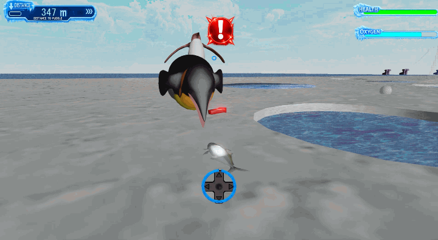

  # 技術紹介(殿河内)

  **ディザリング**

  限られた色数や表現力の中で、中間色や半透明を擬似的に表現する技術です。  
  ```  
  struct SPSIn
{
    float4 pos : SV_POSITION;
    float3 normal : NORMAL;
    float3 tangent : TANGENT;
    float3 biNormal : BINORMAL;
    float2 uv : TEXCOORD0;
};
 
struct SPSOut
{
    float4 albedo : SV_Target0;
    float4 normal : SV_Target1;
    float4 metaricShadowSmooth : SV_Target2;
};
 
#include "../ModelVSCommon.h"
 
Texture2D<float4> g_albedo : register(t0);
Texture2D<float4> g_normal : register(t1);
Texture2D<float4> g_spacular : register(t2);
sampler g_sampler : register(s0);
 
static const int dither_table[4][4] = {
    { 0, 32, 8, 40 }, { 48, 16, 56, 24 },
    { 12, 44, 4, 36 }, { 60, 28, 52, 20 }
};
 
cbuffer CustomBuffer : register(b1)
{
    float g_opacity;   // C++の opacity がここに入る
    float g_isDither;  // C++の isDither がここに入る
    float2 padding;    
};
 
float3 GetNormalFromNormalMap(float3 normal, float3 tangent, float3 biNormal, float2 uv)
{
    float3 binSpaceNormal = g_normal.SampleLevel(g_sampler, uv, 0.0f).xyz;
    binSpaceNormal = (binSpaceNormal * 2.0f) - 1.0f;
    return tangent * binSpaceNormal.x + biNormal * binSpaceNormal.y + normal * binSpaceNormal.z;
}
 
SPSIn VSMainCore(SVSIn vsIn, float4x4 mWorldLocal, uniform bool isUsePreComputedVertexBuffer)
{
    SPSIn psIn;
    psIn.pos = CalcVertexPositionInWorldSpace(vsIn.pos, mWorldLocal, isUsePreComputedVertexBuffer);
    psIn.pos = mul(mView, psIn.pos);
    psIn.pos = mul(mProj, psIn.pos);
    CalcVertexNormalTangentBiNormalInWorldSpace(psIn.normal, psIn.tangent, psIn.biNormal, mWorldLocal, vsIn.normal, vsIn.tangent, vsIn.biNormal, isUsePreComputedVertexBuffer);
    psIn.uv = vsIn.uv;
    return psIn;
}
 
SPSOut PSMainCore(SPSIn psIn, int isShadowReciever)
{
    SPSOut psOut;
    // テクスチャの色をサンプル（ここでアルファ値も取得される）
    psOut.albedo = g_albedo.Sample(g_sampler, psIn.uv);
    uint d_x = (uint) psIn.pos.x % 2;
    uint d_y = (uint) psIn.pos.y % 2;
 
    // --- 0.5f ではなく、テクスチャのアルファ値(psOut.albedo.a)を使う ---
    clip(psOut.albedo.a - (float) dither_table[d_y][d_x] / 64.0f);
    // ------------------------------------------------------------
 
    psOut.albedo.w = psIn.pos.z;
    psOut.normal.xyz = GetNormalFromNormalMap(psIn.normal, psIn.tangent, psIn.biNormal, psIn.uv);
    psOut.normal.w = 1.0f;
    psOut.metaricShadowSmooth = g_spacular.Sample(g_sampler, psIn.uv);
    psOut.metaricShadowSmooth.g = 255.0f * (float) isShadowReciever;
    return psOut;
}
 
SPSOut PSMain(SPSIn psIn) { return PSMainCore(psIn, 0); }
SPSOut PSMainShadowReciever(SPSIn psIn) { return PSMainCore(psIn, 1); }  
  ```

  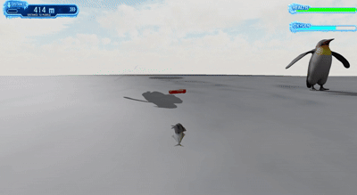

  これにより段階的に浮かび上がるようになりました<br>
  エネミーに実装
